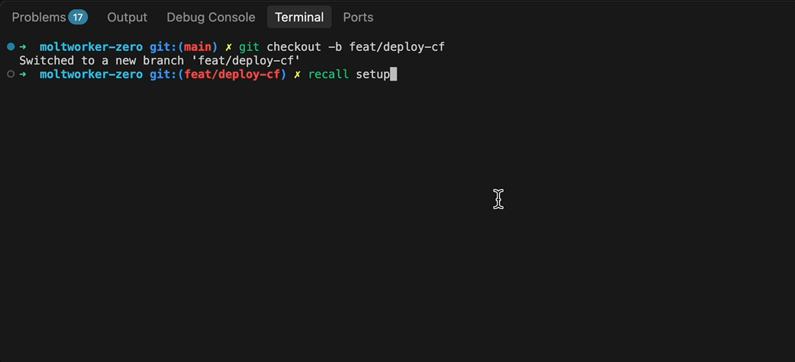
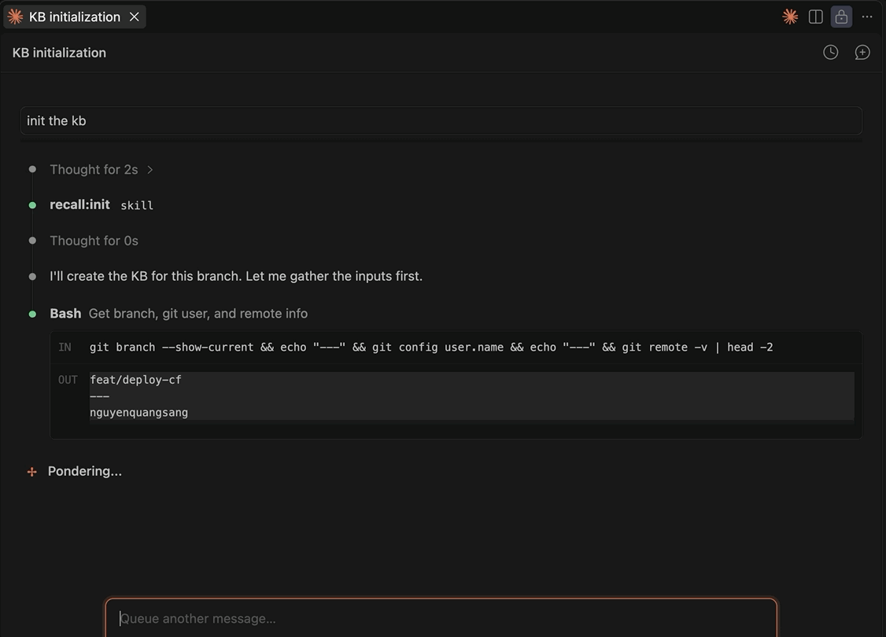
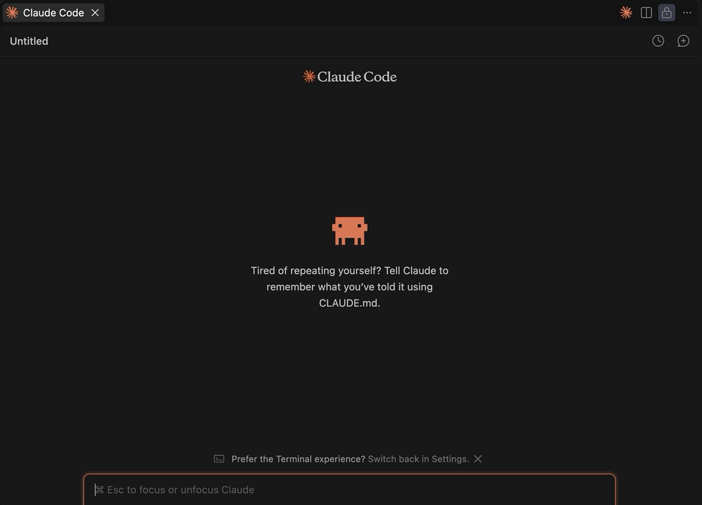
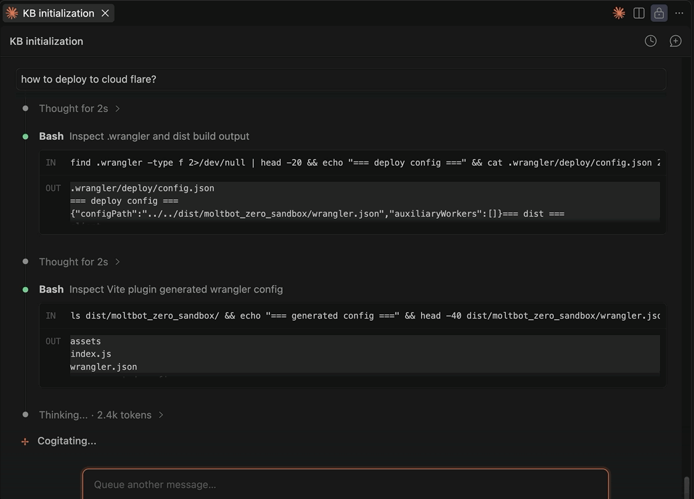

# kb-recall User Guide

A practical walkthrough for setting up and using kb-recall day-to-day.

---

## Table of Contents

1. [What problem this solves](#1-what-problem-this-solves)
2. [Installation](#2-installation)
3. [Your first feature KB](#3-your-first-feature-kb)
4. [Daily workflow](#4-daily-workflow)
5. [Slash commands](#5-slash-commands)
6. [Tool reference](#6-tool-reference)
7. [Writing good memories](#7-writing-good-memories)
8. [KB structure on disk](#8-kb-structure-on-disk)
9. [Troubleshooting](#9-troubleshooting)

---

## 1. What problem this solves

Claude is capable within a session but forgets everything between sessions. Each new conversation starts cold: no memory of bugs you found last week, no awareness of the architectural constraint you established, no knowledge of the edge case that took three hours to debug.

kb-recall gives Claude a persistent knowledge base — organized by feature, not by project. Instead of pasting context into every session, Claude loads it from a KB you've built up over time.

**What gets stored:**

- Stable knowledge: architecture decisions, business rules, tech stack, key files, constraints, warnings
- Dynamic journal: bugs found, edge cases, trade-off decisions, breaking changes — newest first

**What doesn't get stored:** routine implementation details, anything derivable by reading the code.

---

## 2. Installation

### Step 1 — Install the CLI

Requires [uv](https://docs.astral.sh/uv/). Two install sources — pick whichever your network allows:

```bash
# From PyPI (recommended — stable releases)
uv tool install kb-recall

# From GitHub (latest main, or if PyPI is blocked on your network)
uv tool install git+https://github.com/nguyenquangsang/kb-recall.git
```

Either way, `uv tool install` installs into its own isolated environment and exposes a `recall` command on your PATH. Verify:

```bash
recall --help
```

**Contributing to kb-recall itself?** Clone it and install in editable mode instead, so code edits take effect immediately:

```bash
git clone git@github.com:nguyenquangsang/kb-recall.git ~/kb-recall
cd ~/kb-recall
uv tool install --editable .
```

### Step 2 — Run setup for your project

```bash
cd ~/your-project
recall setup
```



This does five things in one pass:

1. **Register MCP server** — `claude mcp add --scope user recall ...`. Verify with `claude mcp list`.
2. **Configure project** — adds the project path to `~/.recall-mcp/config.json`, and writes the kb-recall section into `CLAUDE.local.md` (created if missing, added to `.gitignore`) — not the team-shared `CLAUDE.md`, since these are per-developer opt-in instructions.
3. **Configure issue tracker** — asks once whether the project uses Jira or none/other, saved to `config.json` so `/recall:init` never has to ask again. Skipped automatically (not guessed) when run non-interactively.
4. **Install hooks** — adds the `UserPromptSubmit` hook (the `recall prompt` command, written as an absolute path — see [Installation](README.md#installation)) to `~/.claude/settings.json`. This is the only hook kb-recall installs — it injects the feature index, branch-based KB suggestion, and the turn-counter save reminder on every prompt. (An earlier design also used a `PreCompact` hook for a pre-compaction save reminder; that was dropped — a turn-counter reminder via `UserPromptSubmit` covers the same need without the extra hook.)
5. **Sync slash commands** — same as running `recall sync-commands` (see below).

Reload Claude Code after setup. Every prompt will include the feature index and a KB suggestion if the current branch matches a known feature slug.

---

## 3. Your first feature KB

Walk through this the first time to understand the full flow.

### Create the KB

Tell Claude:

> "Create a feature KB for the payment gateway — it handles Stripe checkout and webhook reconciliation. Slug: payment-gateway"



Claude calls:

```
init_feature(
  name="Payment Gateway",
  slug="payment-gateway",
  summary="Handles Stripe checkout and webhook reconciliation",
  project="my-project",
  ticket="PROJ-1234",
  branch="feat/payment-gateway"
)
```

This creates:

```
~/.recall-mcp/my-project/
├── features.md                   ← updated with new row
└── payment-gateway/
    ├── README.md                 ← empty section placeholders
    └── memories-{username}.md    ← empty journal
```

### Fill in the README sections

The README has empty XML section placeholders. Fill in what you know:

> "The business rule is: Stripe webhooks can arrive out of order. Always reconcile against DB state, not event order. Idempotency key is the event ID."

Claude calls:

```
update_readme(
  slug="payment-gateway",
  section="business_rules",
  content="**[rule] Webhooks can arrive out of order** — always reconcile against DB state, not event order. Idempotency key = Stripe event ID.",
  confirm=True
)
```

`confirm=True` is safe here since the section is still an empty placeholder — nothing is being overwritten. Omitting `confirm` (defaults to False) instead returns a diff preview and writes nothing; see below.

Repeat for other sections you have content for: `overview`, `key_files`, `technical_stack`, `architecture`, `critical_warnings`, `related_tickets`. Skip sections with nothing to say yet.

For `related_tickets`, use one entry per line: `slug (TICKET-ID): reason`. Claude will hint to load these features when this KB is loaded.

### Verify

```
load_feature_context(slug="payment-gateway")
```

You'll see README + memories. This is exactly what Claude sees at the start of future sessions.

---

## 4. Daily workflow

### Starting a session

When you start working on a feature, Claude should:

1. Call `load_feature_context(slug="<slug>")` to restore context — **before responding, not after**. If the hook is set up, the feature index (first prompt of session) and a branch-based slug suggestion arrive automatically, so this is usually the only call needed.
2. If checking a fact that might live in another feature: `search_features(query="<keyword>")`

`list_features()` is for slug discovery only — call it when you need to see what KBs exist and the hook-injected index isn't enough (e.g. mid-session, or the index wasn't shown). Don't call it as a routine per-session or per-turn orientation step.

**Good prompt to start a session:**

> "I'm working on the payment gateway feature today. Load the KB and then let's look at the webhook handler."



### During a session

When Claude discovers something significant — a bug, an edge case, a constraint, a trade-off — tell it to save:

> "Save this to the KB: the idempotency check must happen before the DB write, not after — learned this from the race condition in the July 2 incident."

Claude calls:

```
save_memory(
  slug="payment-gateway",
  content="Idempotency check must happen BEFORE the DB write — race condition possible if checked after. Incident: July 2."
)
```



After saving, check whether to promote to README: `[gotcha]`/`[constraint]` → `update_readme(section="critical_warnings", mode="append")`; `[decision]` → `update_readme(section="architecture", mode="append")`; `[rule]` → `update_readme(section="business_rules", mode="append")`. Skip promotion for `[bug]`, `[idea]`, and `[pattern]`.

### When architecture changes

If a business rule, tech stack, or architectural constraint changes:

> "Update the KB: we're migrating from Stripe to Adyen. Update technical_stack."

Claude calls:

```
update_readme(
  slug="payment-gateway",
  section="technical_stack",
  content="Payment provider: Adyen (migrated from Stripe, July 2025). ..."
)
```

This is `mode="replace"` (default) with `confirm` defaulting to False — the call above writes nothing and returns a real diff (old vs proposed `technical_stack` content). Show that diff to the user, then call again with `confirm=True` to actually write it.

### When Claude makes a mistake

If Claude ignored something that should have been in the KB — or did something wrong because the KB was missing a rule:

> "Report a miss: Claude forgot that webhooks arrive out of order and tried to process them sequentially."

Claude calls:

```
report_miss(
  slug="payment-gateway",
  description="Attempted sequential processing of webhooks. KB already says events arrive out of order — Claude didn't apply the rule."
)
```

This records a `[MISS]` entry so the gap is visible and you can strengthen the KB. Immediately after, call `update_readme` on the section the miss revealed as missing — `critical_warnings` or `business_rules`. Do not stop at recording the miss.

### Idle-gap cost guard

Claude's 1-hour prompt cache expires after a long idle gap (stepping away, a meeting, the next day). Resuming a large session past that point pays a full cache-write instead of a cheap cache-read — a real cost difference, not just a speed one. The `UserPromptSubmit` hook watches for this and reacts in tiers:

- Past ~50 min idle: a non-blocking reminder — save anything worth keeping, consider `/compact`.
- Past ~55 min idle **and** context already large (~100k+ tokens): the turn is **blocked** outright (Claude is never invoked) so the expensive cache-write never happens. The block message gives you three options: run `/compact` and resend, start a new session with `/recall:load` and resend, or resend with `!!force` prefixed to skip the check once.
- Context alone past ~250k tokens (independent of idle time): a non-blocking nudge — a continuously active session's cache-*read* cost climbs with size even without ever going idle.

If the hard block is more disruptive than useful for how you work, turn it off — the two lighter, non-blocking reminders above keep firing either way:

```bash
recall block-idle false   # disable the hard block
recall block-idle true    # re-enable it (also the default)
```

---

## 5. Slash commands

Slash commands wrap the most common workflows so you don't need to type out tool calls manually.

### Install

Already done if you ran `recall setup` (Step 5 of setup syncs commands). To re-sync after pulling command changes:

```bash
recall sync-commands
```

This symlinks `commands/*.md` to `~/.claude/commands/recall/` (falls back to copying if symlinks aren't available on your filesystem). Reload Claude Code. Commands are now available as `/recall:<name>`.

### Available commands

| Command | What it does |
|---|---|
| `/recall:load [slug]` | Load KB for a feature — slug optional, auto-detects from branch |
| `/recall:save [slug]` | Review session and save insights — slug optional, auto-detects from branch |
| `/recall:list [project]` | List all feature KBs, optionally filtered by project |
| `/recall:init [name]` | Create a new feature KB with guided section fill-in |
| `/recall:miss [slug]` | Report a context miss and strengthen the KB |
| `/recall:link-feature` | Link current branch to an existing KB (after branch rename) |
| `/recall:compact [slug]` | Retire noise from a feature's memories — translate, compress, hide entries already in README |
| `/recall:tidy [slug]` | Rewrite a feature KB's README sections to be compact, English-only, high signal-to-token |

The slug argument is optional for `load`, `save`, and `miss`. When omitted, Claude auto-detects from the current git branch. When provided, fuzzy matching applies — partial names work.

### Examples

```
/recall:load                  ← auto-detect from branch
/recall:load pay              ← matches "payment-gateway"
/recall:load fraud            ← matches "fraud-detection"
/recall:save                  ← auto-detect, confirms before saving
/recall:save pay              ← save to "payment-gateway"
/recall:init Payment Gateway
/recall:miss fraud            ← matches "fraud-detection"
```

Only relevant if you cloned the repo (the "Contributing" editable install from Step 1) — a regular `uv tool install` user has no local `commands/` directory to edit. For contributors: `recall sync-commands` symlinks `commands/*.md` into `~/.claude/commands/recall/`, so editing the source files in your clone takes effect immediately (no reload needed). If your filesystem doesn't support symlinks, it falls back to copying instead — in that case re-run `recall sync-commands` after editing.

---

## 6. Tool reference

### `list_features`

Lists all feature KBs across configured projects.

```
list_features(project="")
```

Call at the start of a session to orient yourself. The hook does this automatically if configured.

---

### `search_features`

Keyword search across every feature's README.md and memories-*.md (all contributors), OR-matched, case-insensitive. Returns lightweight snippets grouped by slug, not full content.

```
search_features(query="webhook retry idempotent", project="")
search_features(query="webhook retry idempotent", project="proj-a,proj-b")
search_features(query="webhook retry idempotent", project="all")
```

Use to verify a specific fact that might live in a feature you aren't currently working in — not for slug discovery, which `list_features` already covers (a near-identical tool, `search_memory`, was removed in 2026-06 for 0 real-world uses once the feature index started covering slug discovery; this tool targets the narrower case that gap didn't cover).

`project="proj-a,proj-b"` (comma-separated) searches just that subset of configured projects; `project="all"` searches every one of them — only pass either when the user explicitly asks for a cross-project search, never as a default; every other case stays scoped to the active project. A name that doesn't match any configured project is silently dropped from the subset (safe failure — narrows the scope rather than erroring or matching the wrong project). Multi-project results are prefixed `<project>/<slug>`, and the footer instructs Claude to show that list to the user and let them choose which KB to load, rather than picking one itself. Once the user picks, pass that project explicitly — `load_feature_context(slug, project="<project>")` — a bare call defaults to your own session's project and can silently load an unrelated same-named feature instead of erroring.

---

### `load_feature_context`

Loads the full README.md + all `memories-{username}.md` files for a feature, merged chronologically.

```
load_feature_context(slug="payment-gateway", project="")
```

The slug is the directory name directly (e.g. `payment-gateway`). Fuzzy resolution handles close misses (≥0.8 similarity). The response header always shows `<project>/<slug>`, so which project's KB was loaded is never ambiguous even when the same slug exists in more than one project.

---

### `save_memory`

Prepends a single insight to the current user's `memories-{username}.md`, dated today.

```
save_memory(slug="payment-gateway", content="...")
```

Only call for significant findings. See [Writing good memories](#6-writing-good-memories) for what qualifies.

---

### `init_feature`

Creates a new feature KB from templates.

```
init_feature(
  name="Payment Gateway",
  slug="payment-gateway",
  summary="One-line description",
  project="my-project",
  ticket="PROJ-1234",
  branch="feat/payment-gateway"
)
```

`project` is required when multiple projects are configured. `ticket` is optional. After calling this, use `update_readme` to fill in the sections.

---

### `update_readme`

Replaces or appends the content of a named section in a feature's README.md.

```
update_readme(slug="payment-gateway", section="business_rules", content="...")                # mode="replace" (default): returns a diff, writes nothing
update_readme(slug="payment-gateway", section="business_rules", content="...", confirm=True)   # writes for real
update_readme(slug="payment-gateway", section="business_rules", content="...", mode="append")  # writes immediately, no diff step
```

`mode="replace"` (default) is two-step: `confirm=False` (default) previews a real diff of old vs proposed content and writes nothing; `confirm=True` writes it. `mode="append"` always writes immediately — `confirm` is ignored.

Valid sections: `overview`, `key_files`, `technical_stack`, `business_rules`, `architecture`, `critical_warnings`, `open_items`, `checklist`, `related_tickets`.

Call after `init_feature` to fill in sections from scratch, or whenever a section becomes outdated.

---

### `update_feature_index`

Updates one cell (`ticket`, `branch`, or `summary`) and the Last Updated date on a feature's row in `features.md` (the index row, not README.md content). `append=True` adds `, {value}` to the existing cell instead of replacing it.

```
update_feature_index(slug="payment-gateway", field="summary", value="...")                  # returns a diff, writes nothing
update_feature_index(slug="payment-gateway", field="summary", value="...", confirm=True)    # writes for real
update_feature_index(slug="payment-gateway", field="branch", value="feat/v2", append=True, confirm=True)   # keep old branch, add new one
```

Called by `/recall:save` (Step 8) at end-of-session when the summary has drifted from the feature's current scope — checking here is free since the KB is already fully loaded; and by `/recall:link-feature` when linking a renamed branch to an existing KB. Not meant to be called mid-task otherwise.

---

### `report_miss`

Records a context miss — a mistake Claude made that the KB should have prevented.

```
report_miss(slug="payment-gateway", description="...")
```

Creates a `[MISS]` entry in `memories-{username}.md`. Use this to track where the KB has gaps and strengthen it over time.

---

## 7. Writing good memories

**Save these:**

- A bug you discovered and its root cause
- An edge case that's not obvious from the code
- A trade-off decision and why you made it
- A breaking change in a dependency
- An architectural constraint that future work must respect
- A "gotcha" that cost time to debug

**Skip these:**

- Routine implementation steps ("added X field to Y table")
- Anything clearly derivable from reading the code
- Temporary notes ("TODO: check this later")
- Things already documented in the README section

**Format:** Use the `[tag] title` / What / Why / Apply structure. Tags: `[gotcha]` `[bug]` `[decision]` `[constraint]` `[rule]` `[idea]` `[pattern]`.

`[rule]` = non-negotiable domain invariant that the code must always enforce (e.g. "payment must be idempotent"). Auto-promoted to `business_rules` README section.

`[idea]` = promising approach or direction raised during discussion but not yet decided. Stays in memories only — not promoted to README. When decided, save again as `[decision]`.

```
**[tag] short title**
What: <what happened or what the constraint is>
Why: <root cause, incident, or reason it matters>
Apply: <when/where to apply this — be specific>
```

**Examples:**

Good:
```
**[gotcha] Webhooks can arrive out of order**
What: Stripe webhooks can arrive minutes or hours late, and out of order.
Why: Event delivery is at-least-once, not ordered — learned from July 2 incident.
Apply: Always reconcile against DB state; never trust event order. Idempotency key = event ID.
```

Too vague:
> `Webhooks are tricky.`

Too much:
> `[500 lines of webhook handler code]`

---

## 8. KB structure on disk

All KB files live in `~/.recall-mcp/` — completely outside your project repo.

```
~/.recall-mcp/
├── config.json                          ← project paths
├── usage.log                            ← every tool call, human-readable
├── usage.jsonl                          ← same data as JSON Lines
└── my-project/
    ├── .git/                            ← one repo per project, created on first write
    ├── features.md                      ← index of all features
    └── payment-gateway/
        ├── README.md                    ← stable knowledge
        └── memories-{username}.md      ← prepend-only journal, one per contributor
```

### README.md sections

| Section | What goes here |
|---|---|
| `overview` | What this feature does in 2–3 sentences |
| `key_files` | Most important source files and what they do |
| `technical_stack` | Libraries, APIs, services this feature depends on |
| `business_rules` | Non-negotiable rules the code must enforce |
| `architecture` | How the pieces fit together; data flow |
| `critical_warnings` | Things that will cause production incidents if ignored |
| `open_items` | Known issues, deferred work, things to investigate |
| `related_tickets` | Related features/tickets — hinted on load for cross-feature context |
| `checklist` | Gate criteria, deployment steps, review checklist |

### memories-{username}.md

One file per contributor. Prepend-only — newest entry is always at the top. Never edit existing entries, add new ones. `[MISS]` entries mark places where the KB failed to prevent a mistake. `load_feature_context` merges all contributors' files chronologically at read time.

### Git history

`~/.recall-mcp/<project-name>/` is initialized as a git repo automatically on first write (`git init` only) — kb-recall itself never auto-commits. The scope is per project, not one repo for all of `~/.recall-mcp/`: different projects have different collaborators, so sharing one project's KB must not carry another project's KB with it. This makes it ready for you to commit/push manually if you want to version or share the KB (e.g. via a shared remote), without kb-recall's own writes fighting a sync workflow. To snapshot history yourself:

```bash
git -C ~/.recall-mcp/<project-name> add -A
git -C ~/.recall-mcp/<project-name> commit -m "KB snapshot"
git -C ~/.recall-mcp/<project-name> log --oneline
```

---

## 9. Troubleshooting

### "Feature not found" when calling `load_feature_context`

Check the slug. The slug is the directory name directly — no `feature-` prefix.

```bash
ls ~/.recall-mcp/my-project/
# payment-gateway  ← slug is "payment-gateway"
```

Fuzzy resolution (≥0.8 similarity) handles close misses. If it still fails, check that `project=` matches your project name.

### Claude isn't loading the KB automatically

1. Check `CLAUDE.local.md` (or legacy `CLAUDE.md`) has the kb-recall section. The hook warns once per session if it's missing (deduped, not on every prompt).
2. Check the hook is running: open a new chat and look for `[recall-mcp: ...]` lines at the top of the context.
3. Check `~/.recall-mcp/config.json` lists your project path exactly.

### Hook isn't firing

Verify the hook is registered in `~/.claude/settings.json` and that you've reloaded Claude Code. Test manually:

```bash
cd /your/project
recall prompt
```

Should print the feature index. If it prints nothing, check that `config.json` contains the project path and that `~/.recall-mcp/your-project/features.md` exists.

If the hook is registered but never fires, check the command it was written with:

```bash
grep -A3 UserPromptSubmit ~/.claude/settings.json
```

It should be an absolute path (`/Users/you/.local/bin/recall prompt`), not a bare `recall prompt`. Claude Code spawns hook commands through a shell that does not source `.zshrc`, so a bare name resolves only if `~/.local/bin` is on the PATH that shell inherits — otherwise the hook fails silently, injecting nothing and printing no error. Re-run `recall setup` to rewrite it as an absolute path, or confirm the absolute path resolves:

```bash
/path/shown/in/settings.json
```

### `list_features` returns empty

No features have been created for this project yet. Call `init_feature` to create the first one.

### MCP server not connecting

```bash
claude mcp list          # verify recall is listed
uv run --project ~/kb-recall recall-server   # test server starts without errors
```

If `uv` is not found, install it: `curl -LsSf https://astral.sh/uv/install.sh | sh`

### Checking usage logs

```bash
tail -f ~/.recall-mcp/usage.log          # live feed of tool calls
cat ~/.recall-mcp/usage.jsonl | python3 -m json.tool  # pretty-print
```

---
